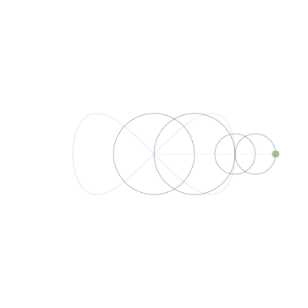

# Timur Manjosov

*Developer on a journey — building with clarity, purpose, and patience.*

*Rabbi zidni ilma*
 
(My Lord, increase me in knowledge)

  

 

Part-time mathematics student funding my own studies, working toward a career in
quantitative and actuarial work — risk, modelling, and data. I came to programming
through maths, and I stay for the same reason I like maths: I want to understand
things from the ground up, not just use them.

I run Arch Linux on a ThinkPad and try to know my tools properly — what they do,
why, and what's underneath. I care about privacy and open source, and I'd rather
learn one thing well than collect a dozen half-known skills.

## Currently focusing on

- **Python for data and quantitative work** — building the bridge between my maths
  background and real computation.
- **Systems and low-level programming** with **Rust** and **C**, because I want to
  understand how computers actually work, not just what runs on top of them.
- Getting comfortable with the everyday craft: the shell, Git, and a Linux system
  I configure myself.

## Tech & tools

- **Arch Linux** — daily driver; comfortable living in the terminal and maintaining
  my own setup.
- **Python** — my main language for data and quantitative problems. Still building
  fluency.
- **Rust** — learning. Drawn to it for safety and for what it teaches about memory
  and systems.
- **C** — learning. The closest honest look at how the machine works.
- **Git** — part of my daily workflow; still deepening my understanding of the harder
  parts.

I'm early in this journey and mark things as "learning" when they are — I'd rather be
accurate than impressive.

## Goals

- Build a solid, lasting foundation in mathematics and programming rather than chasing
  trends.
- Grow into quantitative / actuarial work where rigour and data meet.
- Keep understanding my tools deeply, and keep what I build open where I can.

 

*Learning slowly. Building steadily.*

 

🔧 how the art above was made

 

No banner generators, no third-party services — every image on this page comes from
a small mathematical system, rendered to static SVG in the Nord palette:

- **Header** — a [De Jong strange attractor](https://en.wikipedia.org/wiki/De_Jong_attractor)
  (`x' = sin(ay) − cos(bx)`, `y' = sin(cx) − cos(dy)`), 4,500 iterated points banded
  by distance from the centroid and revealed outward from the core on load.
- **First divider** — a [Rule 90](https://en.wikipedia.org/wiki/Rule_90) cellular
  automaton: several Sierpinski triangles grown from seeded rows.
- **Second ornament** — a Koch curve generated from an L-system (`F → F+F--F+F`,
  turn angle 60°) and drawn on with a `stroke-dashoffset` animation.
- **Footer** — a discrete Fourier transform of a lemniscate (∞), reconstructed from
  its ten largest frequency components as nested, rotating epicycles and drawn with
  pure SVG/SMIL — no JavaScript, no canvas.

One dependency-free Python script generates all four:
[`scripts/generate_art.py`](scripts/generate_art.py).

